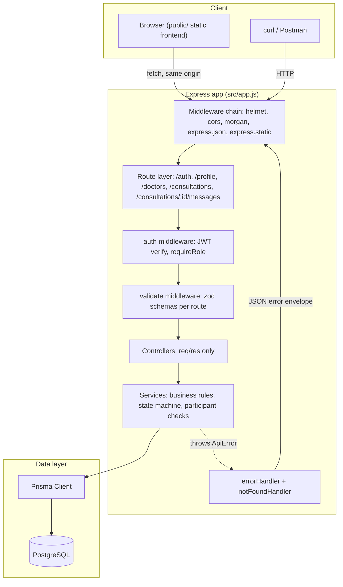

# Deep Dive: Doctor-Patient Consultation Backend

This document is a full technical walkthrough of how the system is built: the request lifecycle, the data model, the module structure, the business rules, the frontend, the test strategy, and the deployment setup. It assumes you have already read the [README](./README.md) for setup instructions and the [SPEC](./SPEC.md) for the original design rationale. This doc goes one level deeper: how the pieces actually fit together, and why specific implementation choices were made.

## Architecture overview



At the container level, `docker compose up` runs two services: `db` (Postgres 16) and `app` (this Express server). The `app` container's start command runs `prisma migrate deploy`, then `prisma/seed.js`, then `node src/server.js`, in sequence, so a single command takes a fresh checkout to a running, seeded API.

## Request lifecycle

Every request passes through the same middleware chain, defined in `src/app.js`, in this order:

1. `helmet()`: sets security headers (CSP, no-sniff, etc).
2. `cors()`: open CORS policy. There is no separate frontend origin to restrict to, since the frontend is served by the same Express app.
3. `morgan('dev')`: request logging, skipped in `NODE_ENV=test` so test output stays clean.
4. `express.json()`: body parsing.
5. `express.static(publicDir)`: serves `public/index.html`, `public/styles.css`, `public/app.js`. If a request doesn't match a static file, Express falls through to the next middleware automatically, so this is safe to mount ahead of the API routes.
6. The API routers: `/auth`, `/profile`, `/doctors`, `/consultations` (mounted twice, once for the consultation routes and once for the nested `/consultations/:id/messages` routes).
7. `notFoundHandler`: catches anything unmatched.
8. `errorHandler`: catches everything thrown or passed to `next(err)` anywhere upstream.

Express 5 forwards rejected promises from async route handlers to the error-handling middleware automatically. Every controller in this codebase is an async function with no try/catch: any thrown `ApiError`, or any unexpected error, lands in `errorHandler` without extra wiring. This is a deliberate simplification made possible by upgrading to Express 5; the earlier project spec assumed an `asyncHandler` wrapper utility, which turned out to be unnecessary.

## Error handling

`src/utils/ApiError.js` defines a small error class: `status`, `message`, `code`, optional `details`. Every business rule violation in a service throws one of these. `src/middleware/errorHandler.js` catches it and renders the shared envelope:

```json
{ "error": { "message": "...", "code": "..." } }
```

Two special cases are handled outside `ApiError`: JWT verification failures (`JsonWebTokenError`, `TokenExpiredError`) map to a generic 401, and anything unrecognized falls through to a logged 500. Validation failures get an extra `details` array (see below), everything else keeps the envelope minimal.

## Validation layer

`src/middleware/validate.js` takes a `{ body, query, params }` map of zod schemas and returns one middleware. Each present schema is parsed with `safeParse`; on failure, it throws a 400 `ApiError` with a `details` array of `{ path, message }` pairs pulled from the zod issue list, so the client gets field-level feedback instead of one flat string.

One implementation detail worth calling out: Express 5 made `req.query` a getter with no setter. The original implementation tried `req.query = parse(...)`, which threw a `TypeError` at runtime on every route with a query schema (`GET /doctors`, `GET /consultations`, `GET /consultations/:id/messages`). The fix replaces the property descriptor instead of assigning to it:

```js
Object.defineProperty(req, 'query', { value: parse(query, req.query), configurable: true });
```

`req.body` and `req.params` remain plain assignable properties in Express 5, so only the query path needed this treatment. This was caught by manual curl testing before it reached the automated test suite, since the coerced defaults (`page`, `limit`) only apply on the query path.

## Data model

Four tables, defined in `prisma/schema.prisma`:

- `User`: name, email (unique, always stored lowercase), password hash, role (`PATIENT` or `DOCTOR`).
- `DoctorProfile`: one-to-one with `User`, holds `specialization` and `yearsOfExperience`. Kept separate from `User` because a doctor's clinical profile is a distinct concern from account/auth data, and because patients never need these fields.
- `Consultation`: `patientId` and `doctorId`, both foreign keys to `User.id`, plus a `status` enum (`PENDING`, `ACTIVE`, `COMPLETED`).
- `Message`: belongs to a `Consultation`, has a `senderId` foreign key to `User.id`, `content`, `createdAt`.

The single most consequential modeling decision: `Consultation.doctorId` points at `User.id`, not `DoctorProfile.id`. This means a participant check anywhere in the codebase, "is this caller the patient or the doctor on this consultation", is always a direct equality against `req.user.id` (which comes straight from the JWT). There is no join required, and no risk of comparing a `User.id` against a `DoctorProfile.id` by mistake, which was flagged as a likely bug source during spec review before implementation began.

Read endpoints that display a consultation to a user (list, detail, create, status update) join in `patient: { id, name }` and `doctor: { id, name }` via a shared `WITH_NAMES` include object in `consultations.service.js`, so the frontend can show a name instead of a bare id. The internal `getOwnedConsultation` helper, used for ownership and status checks by both the consultations and messages services, deliberately does not include these joins: it only needs `patientId`, `doctorId`, and `status` to answer "is this a participant" and "is this consultation still open", so it stays a single-table lookup.

### The open-consultation constraint

The rule "one open consultation per patient-doctor pair" is enforced twice:

1. An application-level check in `createConsultation`: a `findFirst` for an existing non-completed consultation with the same pair, returning a friendly 409 if found.
2. A partial unique index, added as a hand-written raw SQL migration since Prisma's schema DSL cannot express a `WHERE` clause on a unique index:

```sql
CREATE UNIQUE INDEX unique_open_consultation
  ON "Consultation" ("patientId", "doctorId")
  WHERE status != 'COMPLETED';
```

The application check alone has a race: two concurrent `POST /consultations` requests for the same pair can both pass the check before either has committed. The index is what actually prevents the duplicate row; if the create call still hits a unique-violation (Prisma error code `P2002`) after the check passed, the service catches it and returns the same 409, so the client never sees a raw database error.

### The status state machine

```js
const TRANSITIONS = {
  PENDING: ['ACTIVE'],
  ACTIVE: ['COMPLETED'],
  COMPLETED: [],
};
```

`updateStatus` looks up the consultation, confirms the caller is the assigned doctor (403 otherwise), then checks the requested status against this map. Setting the same status again is treated as an idempotent no-op (200, no state change), since retried PATCH requests are a normal client pattern and shouldn't be treated as errors. Any transition not present in the map is a 409. `COMPLETED` maps to an empty array, so it is a terminal state by construction rather than by a separate immutability check.

## Module structure

Each domain (`auth`, `doctors`, `consultations`, `messages`) lives under `src/modules/<name>/` with up to four files:

- `<name>.schemas.js`: zod schemas for request validation.
- `<name>.routes.js`: Express router, wires middleware (`authenticate`, `requireRole`, `validate`) to controller functions.
- `<name>.controller.js`: thin, only reads `req`/writes `res`, no business logic.
- `<name>.service.js`: all business logic and Prisma calls.

This split means the test suite, which drives everything through supertest against the exported `app`, exercises the same code path a real client would, while still keeping business rules isolated from HTTP concerns. `messages.service.js` imports `getOwnedConsultation` from `consultations.service.js` rather than duplicating the participant/ownership check, since the rule ("is the caller a participant in this consultation") is identical in both modules.

## Authentication and authorization

Registration (`POST /auth/register`) hashes the password with bcrypt (cost factor 10) and, inside a single Prisma transaction, creates the `User` row and, if `role` is `DOCTOR`, the `DoctorProfile` row alongside it. Email is lowercased by a zod `.transform()` before it ever reaches the database, on both register and login, since Postgres's default collation treats `User@x.com` and `user@x.com` as distinct strings and the unique constraint alone would not catch the duplicate.

Login looks up the user by (lowercased) email and compares the password with bcrypt. Whether the email doesn't exist or the password is wrong, the same `ApiError(401, 'Invalid email or password', 'INVALID_CREDENTIALS')` is thrown, so a failed login attempt cannot be used to enumerate which emails are registered.

A successful login returns a JWT signed with `HS256`, payload `{ sub: userId, role }`, 24 hour expiry, secret from the `JWT_SECRET` environment variable (validated at boot to be at least 32 characters via the zod env schema in `src/config/env.js`).

`src/middleware/auth.js` exports two pieces:

- `authenticate`: reads the `Authorization: Bearer <token>` header, verifies it, and attaches `req.user = { id, role }`.
- `requireRole(role)`: a second middleware that 403s if `req.user.role` doesn't match, used to restrict consultation creation to patients.

`/auth/register` and `/auth/login` sit behind a rate limiter (`express-rate-limit`, 30 requests per 15 minutes per IP), skipped entirely when `NODE_ENV=test` so the integration suite isn't throttled by itself.

## Frontend

`public/` is a static, framework-free frontend: one HTML file, one CSS file, one JS file, no build step, no bundler, no external fonts or CDN assets. It is served by `express.static` from the same Express app that serves the API, so there is exactly one process to run and no cross-origin requests to configure.

`app.js` holds a small `state` object (token, current user, consultation list, active consultation id), persisted to `localStorage` so a refresh doesn't log the user out. A single `api()` helper wraps `fetch`, attaches the bearer token when present, and normalizes error responses (including the zod `details` array) into a JS `Error`. The page has two top-level screens (auth, app) toggled by adding or removing a `hidden` class; there is no client-side router, since the screen count is small enough that one doesn't add value.

Inside the chat view, new messages are picked up by polling `GET /consultations/:id/messages` every 4 seconds while a conversation is open, rather than a WebSocket connection. This is a deliberate scope decision: Socket.io was evaluated in the original spec and deprioritized as low value without an existing frontend to consume it; now that a frontend exists, polling gets equivalent user-facing behavior (new messages appear within a few seconds) without adding a stateful connection to maintain, on a codebase whose stated goal is to stay small and readable.

Helmet's default Content Security Policy (`script-src 'self'`, `script-src-attr 'none'`) is compatible with the frontend as written because it uses no inline `<script>` tags and no inline event handler attributes; all event binding goes through `addEventListener` in the external `app.js` file.

## Testing

`tests/api.test.js` uses Node's built-in test runner (`node --test`) and `supertest`, driving the exported Express `app` directly rather than a running server process. A `before()` hook truncates all four tables (`TRUNCATE ... RESTART IDENTITY CASCADE`) and registers two doctors and two patients through the real `/auth/register` and `/auth/login` endpoints, so the fixtures exercise the same code path as a real client.

The suite runs against a separate database, configured via `.env.test`, never the development database. `npm test` first runs `prisma migrate deploy` against that database (Prisma creates the database itself on first run if it does not already exist), then runs the suite. Tests within the one test file run sequentially by default, which matters here since several tests depend on state left behind by earlier tests in the same file (for example, the illegal-transition test and the idempotent-no-op test both operate on the consultation created by an earlier test).

The 11 tests were chosen to cover exactly the rules the assignment's rubric grades, not incidental edge cases: duplicate email (including a case-variant), role restriction on consultation creation, the duplicate-open-consultation conflict, doctor-only status changes, an illegal transition, the idempotent same-status update, message rules around `PENDING` and `COMPLETED`, non-participant access denial, and chronological message ordering.

## Deployment

`docker-compose.yml` defines two services. `db` runs `postgres:16-alpine` with a healthcheck (`pg_isready`), and `app` waits for that healthcheck before starting. The `app` container's command runs migrations, then the seed script, then the server, in one shell command, so `docker compose up` alone takes an empty database to a fully seeded, running API.

The `Dockerfile` is a single-stage build: install dependencies with `npm ci`, copy the source, run `prisma generate` to produce the Prisma client for the container's platform. A `.dockerignore` excludes `node_modules` and `.git` from the build context; without it, `COPY . .` would copy the host's `node_modules` (built for the host's glibc-based libc) over the image's own freshly-installed `node_modules` (built for the Alpine image's musl-based libc), which is fragile even on architectures where it happens to work by accident.

## Known limitations

These are documented in full in the README's Assumptions section, and repeated here with the underlying reasoning:

- No refresh tokens: a single 24 hour JWT is the entire session model. Adding rotation or revocation would add real complexity (a token store, a revocation list) for a scope where session length is not a grading criterion.
- No cancel or decline path: the state machine is strictly `PENDING -> ACTIVE -> COMPLETED`. A real product would need a way for a doctor to decline a pending request or a patient to cancel one, but the assignment's rubric only exercises the three listed statuses.
- Role is self-declared at registration: nothing stops a user from registering as `DOCTOR` and filling in an invented specialization. A production system would gate this behind verification or admin approval; this system does not, since implementing that workflow is out of scope for what is being evaluated.
- No pagination cursor, only offset (`page`/`limit`): fine at the data volumes this system will ever see in evaluation, but would need revisiting before it saw real production traffic.
