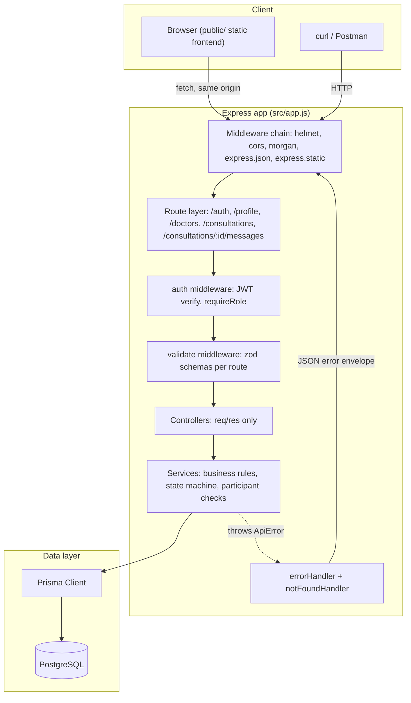
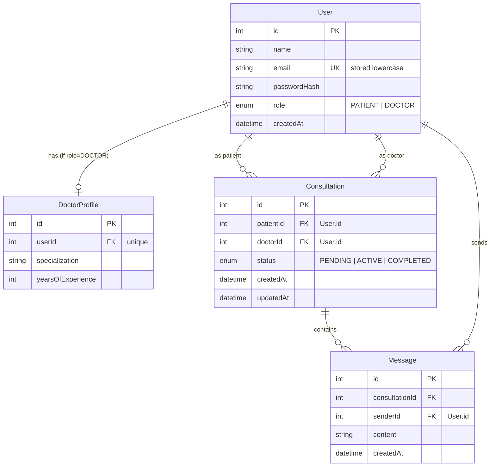

# Doctor-Patient Consultation Backend

A small backend for a healthcare consultation platform: patients register, browse doctors, start a consultation, chat with the assigned doctor, and the doctor moves the consultation through its lifecycle. A minimal web frontend is included so the whole flow can be used from a browser, not just curl or Postman.

For the original design spec and rationale, see [`SPEC.md`](./SPEC.md). For a full technical walkthrough of the architecture, request lifecycle, data model, and every implementation decision behind this codebase, see [`DEEPDIVE.md`](./DEEPDIVE.md). This README covers running the project and using the API.

## Architecture



At the container level, `docker compose up` runs two services: `db` (Postgres 16) and `app` (this Express server). The `app` container's start command runs `prisma migrate deploy`, then `prisma/seed.js`, then `node src/server.js`, in sequence, so a single command takes a fresh checkout to a running, seeded API. Full breakdown of every layer in this diagram is in [`DEEPDIVE.md`](./DEEPDIVE.md).

## Tech stack

Node.js 22, Express 5, PostgreSQL, Prisma, JWT (`jsonwebtoken`) with `bcrypt`, `zod`, `helmet`, `cors`, `express-rate-limit`, `morgan`.

Frontend: plain HTML, CSS, and vanilla JS. No build step, no framework, served as static files straight off the same Express app (`public/`), so there is nothing extra to run or deploy and no CORS to configure.

## Quick start (Docker, one command)

```bash
docker compose up
```

This builds the app image, starts Postgres, runs migrations, seeds the database, and starts the API on `http://localhost:3000`. Seeded logins (password `password123` for all):

| Email                  | Role    | Notes                                                                        |
| ---------------------- | ------- | ---------------------------------------------------------------------------- |
| `doctor1@example.com`  | DOCTOR  | Cardiology, has an ACTIVE consultation with 4 messages and a COMPLETED one   |
| `doctor2@example.com`  | DOCTOR  | Neurology, has a PENDING consultation                                        |
| `patient1@example.com` | PATIENT | in the ACTIVE consultation with doctor1                                      |
| `patient2@example.com` | PATIENT | in the COMPLETED consultation with doctor1, and the PENDING one with doctor2 |

Open `http://localhost:3000` in a browser to use the web UI directly, or try the API with curl:

```bash
curl -X POST localhost:3000/auth/login -H 'Content-Type: application/json' \
  -d '{"email":"patient1@example.com","password":"password123"}'
```

## Manual setup (no Docker)

Requires Node 20+ and a Postgres instance.

```bash
npm install
cp .env.example .env        # edit DATABASE_URL if your Postgres isn't at localhost:5432
npm run migrate              # create schema
npm run seed                 # optional, but recommended, see table above
npm run dev                  # http://localhost:3000
```

## Running tests

Tests run against a separate database so they never touch your dev data.

```bash
cp .env.example .env.test && sed -i 's/consultation$/consultation_test/' .env.test
npm test
```

`npm test` runs `prisma migrate deploy` against `.env.test`'s database (Prisma creates the database itself if it doesn't exist yet), then the suite (Node's built-in test runner with supertest). 11 integration tests cover every rule the assignment grades: duplicate email (including case-variant), role checks on consultation creation, the duplicate-open-consultation conflict, doctor-only status changes, illegal state transitions, idempotent same-status updates, message rules around PENDING and COMPLETED, and chronological ordering.

## API documentation

A ready-to-import Postman collection is at [`postman/consultation-api.postman_collection.json`](./postman/consultation-api.postman_collection.json) (set `patientToken`, `doctorToken`, `doctorId`, and `consultationId` as collection variables after login).

All responses share one envelope:

```json
{ "data": ... }
```

```json
{ "error": { "message": "...", "code": "..." } }
```

Validation failures (400) add field-level detail:

```json
{
  "error": {
    "message": "Validation failed",
    "code": "VALIDATION_ERROR",
    "details": [{ "path": "email", "message": "Invalid email address" }]
  }
}
```

Auth: `Authorization: Bearer <jwt>` on every route except `/auth/*`.

### Auth

**`POST /auth/register`**

```bash
curl -X POST localhost:3000/auth/register -H 'Content-Type: application/json' -d '{
  "name": "Dr. Alice Cardio", "email": "doctor1@example.com", "password": "password123",
  "role": "DOCTOR", "specialization": "Cardiology", "yearsOfExperience": 12
}'
# 201 { "data": { "id": 1, "name": "Dr. Alice Cardio", "email": "doctor1@example.com", "role": "DOCTOR" } }
```

`specialization` and `yearsOfExperience` are required when `role` is `DOCTOR`, ignored otherwise. Duplicate email (case-insensitive) returns `409 DUPLICATE_EMAIL`.

**`POST /auth/login`**

```bash
curl -X POST localhost:3000/auth/login -H 'Content-Type: application/json' \
  -d '{"email":"doctor1@example.com","password":"password123"}'
# 200 { "data": { "token": "...", "user": { "id": 1, "name": "...", "email": "...", "role": "DOCTOR" } } }
```

Bad email or bad password both return the same `401 INVALID_CREDENTIALS` (no user enumeration).

**`GET /profile`**: the caller's own record (includes `doctorProfile` for doctors).

### Doctors

**`GET /doctors`**: optional `?specialization=Cardiology`. Returns `id` as the doctor's user id (use this for `doctorId` below).
**`GET /doctors/:id`**: 404 if no doctor with that user id.

### Consultations

**`POST /consultations`** (patient only)

```bash
curl -X POST localhost:3000/consultations -H "Authorization: Bearer $PATIENT_TOKEN" \
  -H 'Content-Type: application/json' -d '{"doctorId": 1}'
```

- `403` if the caller is a doctor.
- `404` if `doctorId` isn't a doctor.
- `409 DUPLICATE_CONSULTATION` if an open (non-completed) consultation with that doctor already exists. Enforced by a database partial unique index, not just an application check, so it holds under concurrent requests.

**`GET /consultations`**: the caller's own consultations, paginated (`?page=&limit=`, default 1/20, max limit 100).
**`GET /consultations/:id`**: `403` unless the caller is the patient or doctor on it.

**`PATCH /consultations/:id/status`** (assigned doctor only), body `{ "status": "ACTIVE" }`.

- Valid moves: `PENDING` to `ACTIVE` to `COMPLETED`. `COMPLETED` is final.
- Setting the current status again is a no-op `200` (idempotent).
- Any other transition returns `409 INVALID_TRANSITION`.
- Non-assigned doctor or a patient gets `403`.

### Messages

**`POST /consultations/:id/messages`** (participant only), body `{ "content": "..." }` (1 to 5000 chars).

- Allowed while `PENDING` or `ACTIVE`.
- `409 CONSULTATION_COMPLETED` once the consultation is `COMPLETED`.

**`GET /consultations/:id/messages`**: chronological, paginated. `403` for non-participants.

### Error codes

| Status | When                                                                                                                  |
| ------ | --------------------------------------------------------------------------------------------------------------------- |
| 400    | validation failure (see `details`)                                                                                    |
| 401    | missing or invalid token, or bad login credentials                                                                    |
| 403    | authenticated but not allowed (wrong role, not a participant)                                                         |
| 404    | resource doesn't exist                                                                                                |
| 409    | conflict: duplicate email, duplicate open consultation, illegal state transition, message on a completed consultation |

## Database schema



`Consultation.doctorId` references `User.id`, not `DoctorProfile.id`, so a participant check on either side of a consultation is always a direct equality against the caller's own id, with no join needed. See `prisma/schema.prisma` for the full schema and `prisma/migrations/` for the partial-unique-index migration. The full reasoning behind this and every other schema decision is in [`DEEPDIVE.md`](./DEEPDIVE.md).

## Project structure

```
src/
├── config/       env.js (boot-validated env), prisma.js
├── middleware/   auth.js, validate.js, errorHandler.js
├── modules/      auth/ doctors/ consultations/ messages/  (routes/controller/service/schemas per module)
├── utils/        ApiError.js
├── app.js        express app (exported, used directly by tests)
└── server.js     listen()
prisma/           schema.prisma, migrations/, seed.js
tests/            supertest integration tests
postman/          Postman collection
public/           static frontend (index.html, styles.css, app.js)
```

Controllers only touch req and res; business rules (state machine, participant checks) live in services, which is what the test suite exercises through the HTTP layer.

## Assumptions

1. One open (non-completed) consultation per patient-doctor pair, enforced by a partial unique index, surfaced as `409`.
2. No decline or cancel path: `PENDING` to `ACTIVE` to `COMPLETED` only. `CANCELLED` and `REJECTED` states are a deliberate scope cut for this assignment.
3. Messages are allowed while `PENDING` (a patient can describe symptoms before the doctor accepts), blocked only once `COMPLETED`.
4. Role is self-declared at registration; anyone can register as a doctor. A real system would need verification or admin approval; out of scope here.
5. Login returns an identical `401` for an unknown email and a wrong password, to avoid leaking which emails are registered.
6. Emails are stored and compared lowercase to prevent case-variant duplicate accounts.
7. Only `Consultation` has `updatedAt`, since it's the only row that mutates after creation (status). Users and messages are write-once in this scope.
8. No refresh tokens: a single 24 hour JWT is the whole session.

## What's not here (and why)

Redis, refresh-token rotation, roles beyond patient and doctor, file uploads, and a microservice split were all left out on purpose. None of them are exercised by the grading criteria, and adding them would trade clarity for surface area on a 1 to 2 day assignment. Socket.io for live chat, Swagger, and CI were considered as bonus items; see `SPEC.md` section 6 for the reasoning on why Docker, tests, and this README were prioritized over them within the time budget. For the full technical detail behind these and every other decision in the codebase, see [`DEEPDIVE.md`](./DEEPDIVE.md).
